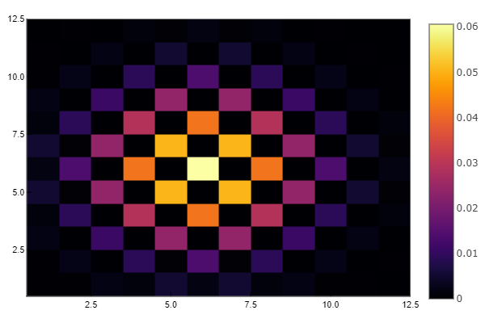
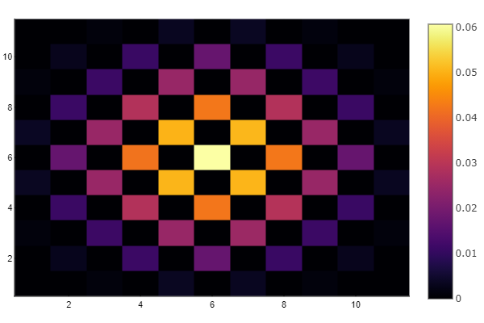
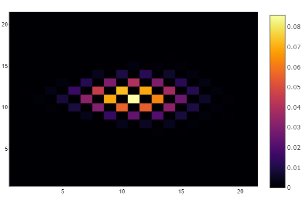
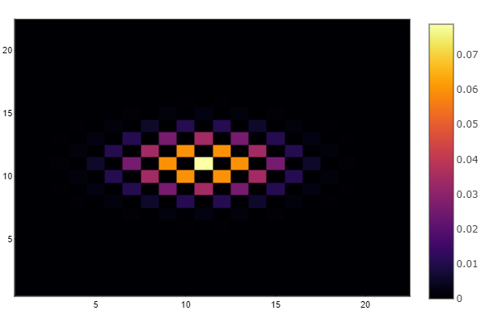
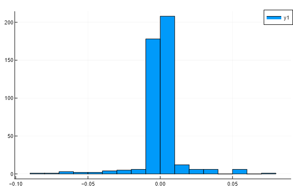
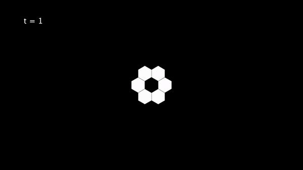

# 2D Hexagonal Random Walks

## Square
First we started with the square lattice. See the plots for the simulation and equation (from Luca Giuggioli's paper: [link](https://journals.aps.org/prx/abstract/10.1103/PhysRevX.10.021045)).

## Hexagonal
Then we looked at the hexagonal lattice. See the plots for the simulation and equation (from my mate's thesis :)).

Note the hexagonal grid is being mapped onto a square lattice, this is why the plot appears squished.

Here is a histogram to visualise the distribution of the errors.

## Animation

Finally I made a simulation of the hexagonal random walk using Processing.

